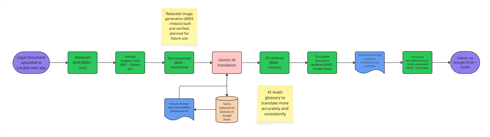

# Certified Legal Document Translation Pipeline

**Turkish ⇄ English certified translation with architecturally enforced PII protection.**

An n8n workflow that takes a scanned legal document, strips every piece of
personally identifiable information *before* any cloud API call, translates the
anonymized text, restores the PII locally, and reassembles the result as a
structure-preserving certified translation package: Translated document, sworn
affidavit, and original source pages all delivered after human review.

Behind the workflow sits a pipeline of five local FastAPI microservices handling
OCR, PII detection, redaction, anonymization, and document assembly.

> Built for a legal services client under NDA. All examples, screenshots, and test
> documents in this repository use synthetic data. No client identifiers appear anywhere.
## Demo

  

<em>
Synthetic divorce decree, English → Turkish. Upload through delivered package.
</em>

## The Problem

Certified translation of legal documents is a slow, manual, high-stakes process.
A single divorce decree, birth certificate, or court record must be transcribed,
translated, formatted to mirror the original, and accompanied by a signed
certificate of accuracy. Under 8 CFR 103.2(b)(3), U.S. immigration filings require
a *complete* English translation of any foreign-language document, together with
the translator's signed attestation of accuracy and competence — where "complete"
means every element on the page, including stamps, seals, and marginal notations,
not merely the body text.

Machine translation solves the wrong half of this. Pasting a legal document into
a translation API returns text in reading order, stripped of the structure that
made it a legal instrument, and, more seriously, transmits names, addresses,
case numbers, and national identity numbers to a third-party service. For
documents whose entire purpose is to record who someone is, that is not an
acceptable trade.

This pipeline was built to solve both halves at once:

- **No PII leaves the local environment.** Detection, redaction, and anonymization
  all run locally. The cloud translation model receives placeholder tokens
  (`[PERSON_1]`, `[CASE_NUMBER_2]`) and never sees the underlying values.
- **Structure is preserved, not flattened.** Output mirrors the source document's
  headings, tables, and layout rather than returning a wall of prose.
- **A human approves before anything is delivered.** Translation is drafted
  automatically; certification is not automatic.

## How It Works

  

A single n8n workflow orchestrates five local FastAPI microservices and a set of
Google services. A browser front end posts a document to the workflow's webhook;
every processing stage between OCR and translation runs locally.

**1) Intake.** A webhook receives the uploaded document. The shared glossary is
loaded from Google Sheets at the start of the run, before OCR, so approved
terminology is available to the run rather than only written at the end of it.

**2) OCR.** `/ocr` (Tesseract) extracts text along with per-word character spans
and pixel bounding boxes. Character spans are built in the same pass as the full
text, so string and offsets cannot drift apart.

**3) PII detection.** The document is split per page. Each page goes to
`/detect-pii` (Microsoft Presidio) while the OCR result is held on a parallel
branch. The two are recombined by matching `page_index` rather than by arrival
order, so pairing is order-independent.

> **A note on `/redact`.** A pixel-level redaction service (`/redact`, port 8003)
> is built and verified: it maps detected PII character spans to the corresponding
> OCR word bounding boxes and draws filled rectangles over them, with a raster-parity
> assertion that fails loudly rather than mis-placing boxes. It runs in the current
> workflow but its output is not yet consumed downstream. The assembled package
> includes the untouched original pages. Wiring redacted images into a
> reviewer-facing path is planned for phase 2.

**4) Anonymization.** `/anonymize` replaces detected entities with typed
placeholders (`[PERSON_1]`, `[CASE_NUMBER_2]`), resolving overlapping spans by
confidence score and trimming boundary artifacts. The mapping is retained locally.

**5) Translation.** Language direction is detected from character frequency.
Gemini 2.5 Flash receives placeholder-bearing text only.

**6) Restoration.** `/restore` reinserts the original PII values into the
translated text at their mapped positions, locally.

**7) Glossary harvest.** A parallel branch extracts terminology from the
*anonymized* translation, deduplicates it with Turkish-locale-aware casing, and
appends or updates rows in the shared glossary. Verified entries are structurally
unreachable by the write path.

**8) Rendering.** `/render-body` converts the reassembled Markdown into a DOCX
that mirrors the source document's headings, tables, and layout, flagging
uncertain regions for reviewer attention.

**9) Human review.** The draft is uploaded to Drive and shared. The workflow
halts at a Wait node until a reviewer submits the approval form. The reviewer may
edit the DOCX in Word and re-upload before approving.

**10) Assembly and delivery.** `/assemble` converts the approved document,
merges it with the signed affidavit and the original source pages into a single
bookmarked PDF with cleared metadata, then delivers via Drive and Gmail.

### Services

| Port | Endpoint | Responsibility |
|------|----------|----------------|
| 8001 | `/detect-pii` | Presidio entity detection (EN + TR) |
| 8002 | `/ocr` | Text extraction with word character spans and pixel boxes |
| 8003 | `/redact` | Pixel-level redaction of source images |
| 8004 | `/anonymize`, `/restore` | Placeholder substitution and reversal |
| 8005 | `/render-body`, `/assemble` | DOCX rendering, PDF assembly |

## The Privacy Chain

The constraint driving this architecture: legal documents exist to record who
someone is. A divorce decree is names, addresses, national identity numbers, and
case numbers — the document is the PII. Sending one to a translation API means
transmitting all of it to a third party.

This pipeline is built so that cannot happen, as a property of the graph rather
than a matter of policy.

**Detection, anonymization, and restoration all run locally.** The translation
model receives text in which every detected entity has been replaced by a typed
placeholder. It never receives a name, an address, or a case number. Restoration
happens on the local machine after the translated text returns.

**The glossary branch is also PII-free.** Terminology extraction runs on the
anonymized translation, before restoration — so the shared glossary in Google
Sheets can never accumulate PII as a side effect.

**What this claim does and does not cover.** The completed translation contains
the original PII by necessity — it is the deliverable. It is uploaded to Google
Drive for review and sent by Gmail on approval. The guarantee is specific and
worth stating precisely: *no personally identifiable information is exposed to
the third-party translation model.* Delivery to the client's own document
infrastructure is a separate trust boundary, governed by the client's existing
data agreements rather than by this pipeline.

**Verified behavior.** Placeholder survival through translation was tested across
both language directions, including entities spanning line breaks: 12/12 tokens
survived intact. Structure recovery succeeded on 5/5 pages of the synthetic
five-page test document.

## Structural Fidelity

The requirement that shaped this build: the output must be a structural mirror
of the source, not its text in reading order. A translated decree that loses its
headings, tables, and clause numbering is no longer usable as a legal instrument,
regardless of how accurate the translation is.

  

Translation output is Markdown with a deliberately narrow grammar — only what the
translation stage is instructed to emit. `md_render_v1.py` maps it to Word:

| Markdown | Rendered as |
|----------|-------------|
| `# Heading` | Heading 1 |
| `## Heading` | Heading 2 |
| `\| a \| b \|` with separator row | Real Word table, computed column widths |
| Case caption (pre-heading text, page 1) | Centered caption block |
| Page footer boilerplate | Centered small caption |
| Everything else | Justified body paragraph |

**Clause numbers are plain text.** Legal numbering (`1.1.`, `2.3.`,
`VIII.`) is important to recreate accurately. Rendering it as a Word list would hand
renumbering control to Word, and a decree whose clause numbers silently shift is
a corrupted document. The translation stage is instructed never to emit Markdown
list syntax, so the risk is removed at the source rather than patched downstream.

**Uncertainty is surfaced and flagged.** A table whose rows disagree with its
header still renders, with an amber review flag placed above it. A pipe-delimited
block with no separator row is not treated as a table at all and falls through to
paragraphs. OCR artifacts (fused captions, garbled cells) are reproduced
faithfully rather than cleaned up. Guessing at what a damaged cell *meant* is the
confident-wrong failure mode, and in a certified translation it is worse than
visibly flagging the problem for the reviewer who is there to catch it.

**One design decision was reversed after production.** Earlier builds forced a
hard page break between source pages, so translation page N matched source page N.
In practice that made translation length on any one page load-bearing for layout
on every later page: Turkish and English differ in length, content pushed past its
natural boundary, collided with the next forced break, and stranded sections alone
on near-empty pages. Content now flows naturally. Page-number alignment between
source and translation drifts as a result and the page caption already present in each 
page's text remains the visible marker of where one source page ends and the next begins.

**Raster parity is enforced.** `/ocr` and `/redact` import the same
rasterization module, and `/redact` asserts that image dimensions match those
reported by `/ocr` before drawing any box. A mismatch raises (rather than placing)
redaction boxes at wrong coordinates.
